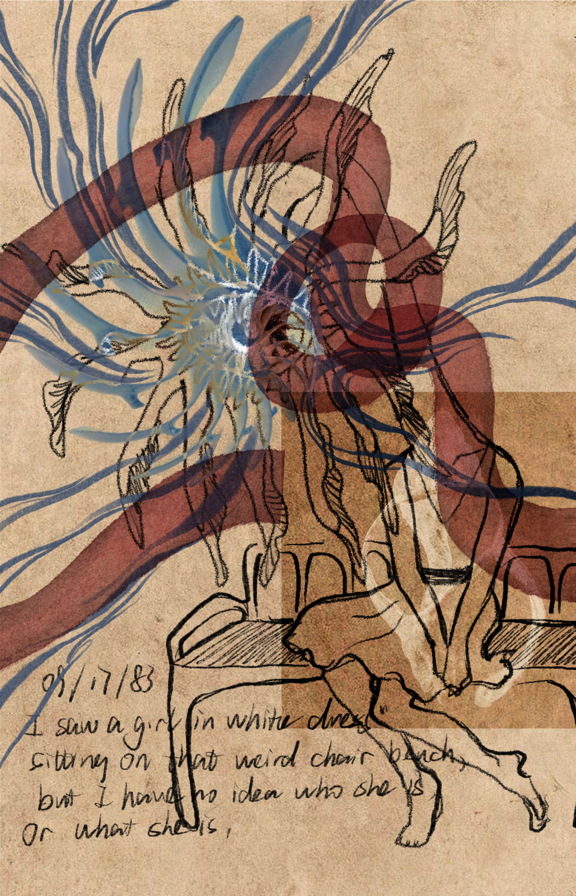
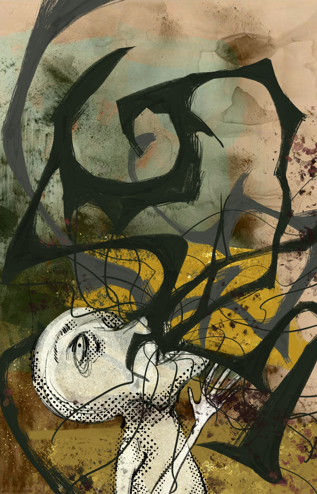

# Project Proposal

### Title: Anything but Fish

> Is that the truth surfacing, or a corpse?

**Team:** [Celia Liang](https://github.com/liangchuxin) cl7093, [Yazhen Li](https://github.com/Yazhen-L) yl11087

*“The oldest and strongest emotion of mankind is fear, and the oldest and strongest kind of fear is fear of the unknown.”*
*—— H. P. Lovecraft, The Call of Cthulhu*

### What is it?

A narrative collection game for mobile web. The end user takes the role of a field investigator at a research institute whose work is the investigation of anomalous regions.

The organization has only one fixed fishing spot. That pond brings up anything but fish: a block of ice that will not melt, a boot rusted through, a heart that is still beating. What comes up leads to another world, and the player uses it as a key to enter each of the story lines.

The game is made of two layers. The main layer is pre-written illustrated narrative, presented with accompanying artwork. Outside the game, the player can choose to have free-form text conversations with the contacts encountered during an investigation, separate from the main line. Through the choices made in the main line and through open conversation, these bonds are drawn in directions that cannot be foreseen.

At the end of each investigation the player returns with a trophy, which is filed into the institute's archive, building up a continuously accumulating body of text and a collection that grows larger over time.

  

### Why?

We want to use AI to explore a new form of narrative, finding a balance between the unpredictability of conversation and structured storytelling. We have a large body of written text backing the AI's behavior, while the AI in turn brings more unpredictability to the story.

This is also something we want the player to experience firsthand. Stories of this kind usually end with the unknown destroying the person. We want to write it the other way around: fear comes from not looking. Staying curious about the unknown, and staying alert to everything around you, is how you overcome it. Every file the player reads and every question the player asks is part of turning the unknown into something known.

### For whom

The initial users are the gaming community at NYU. Our group members, Celia Liang and Yazhen Li, will be the first playtesters.

Building on that, the product is aimed at three broader groups of users.

Players of narrative and collection games. They have a steady interest in long-running worlds, collections that accumulate over time, and relationships with characters, and they are used to playing in short sessions on mobile.

Users who live and work in dense urban environments and are looking for an immersive experience to step away into. The product offers a world with no connection to their everyday context, and a chance to recover curiosity and focus inside it. Its value lies in letting someone step briefly out of a constant external rhythm and return to a state closer to themselves, rather than in simple entertainment.

Users who were interested in AI character conversation products but stopped using them because there was no narrative behind them. The reason this group drops off corresponds directly to the layered design of this project.

  

### How

After logging into their own account, an end user can take a sample at the institute's fixed sampling point and obtain one anomalous object. Each object carries a three level colour marking that corresponds to a low, medium or high anomaly rating. The rating determines the difficulty of the region the object points to, and inversely determines the amount of insurance the institute provides for the assignment. The user decides on that basis whether to accept the assignment, and on accepting it begins the investigation.

The investigation is a pre written sequence of text and images with accompanying illustration. The sequence contains a number of optional branch points, and the user's choice at each point does not change the outcome of the investigation but writes into two sets of values, one being the character's own attributes and the other being the relationship value between the user and the contacts encountered in that investigation. At the end of an investigation the user returns with a trophy, which generates a case file that is filed into the institute's archive. The user can browse the archive and open any object to read its full case file and trace the story back. Outside the main line, the user can hold private conversations with contacts they have met before. This part uses free text input rather than preset options, and each contact responds according to its own persona configuration, with the range of topics it will discuss determined by the user's current attribute and relationship values, and with conversation memory retained across sessions. Conversation content is not written into case files and therefore does not affect the main narrative.

### Scope

I think project is not a simple one for a team, because it requires several systems that are independent of each other and at the same time depend on each other: multi user persistent data (objects, case files, attribute values, relationship values, teams and keepsake ownership), content management that brings the written text, images and illustrations into the system, and an LLM conversation system built on personas and value based gating with memory retained across sessions. These parts can be split up and worked on in parallel by different members.

At the same time it is not overly ambitious. The project involves no real time rendering, no 3D content and no game engine. Both the main line and the conversations are carried by text, images and structured choices, which in implementation terms falls under interface and state management. The conversation component calls an existing AI API, so the team's work is concentrated on persona design, gating rules and the memory mechanism, with no model training involved. Illustrations are provided by an outside collaborating illustrator and credited, so they are not a blocking item for the team.
